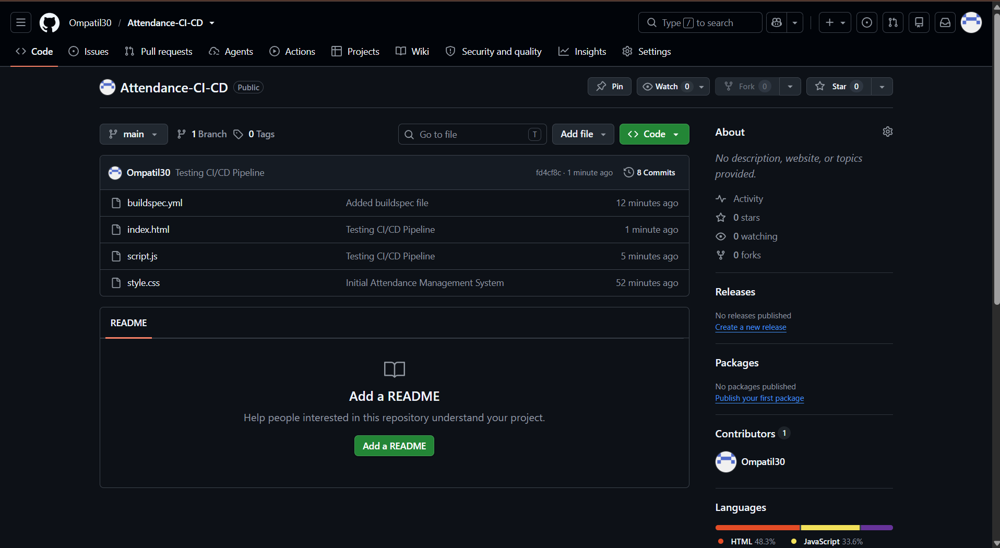
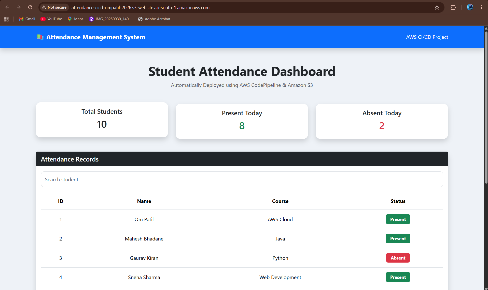
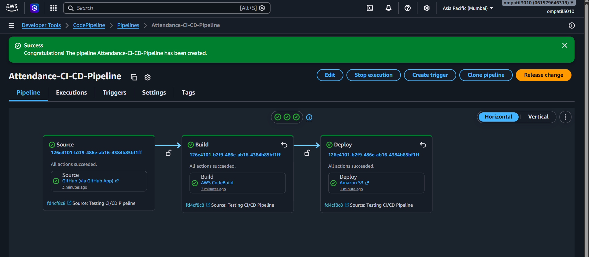
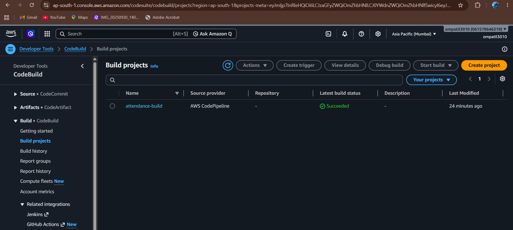
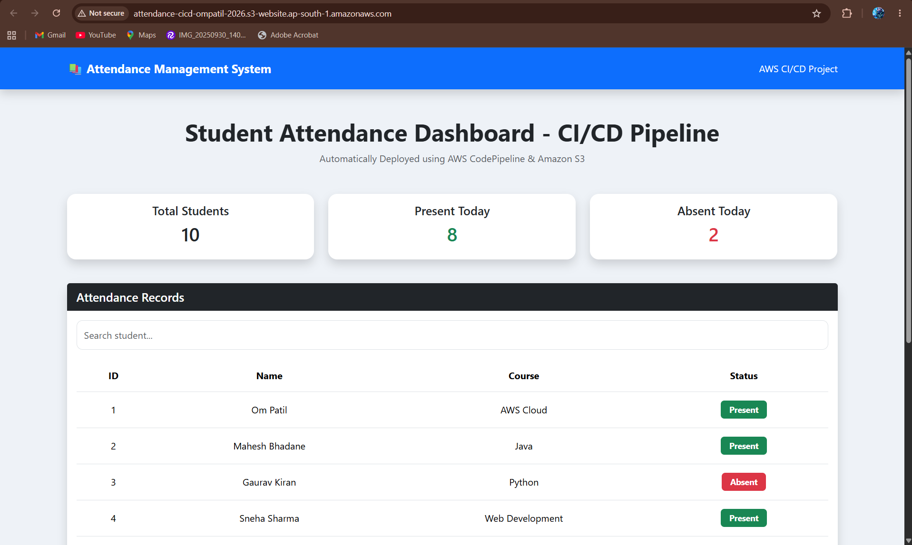

# 🚀 CI/CD Pipeline for Attendance Management System

## 📌 Project Overview

This project demonstrates a complete **CI/CD (Continuous Integration and Continuous Deployment)** pipeline for a static Attendance Management System using AWS services.

Whenever changes are pushed to the GitHub repository, AWS CodePipeline automatically builds and deploys the updated website to an Amazon S3 bucket configured for static website hosting.

---

## 🎯 Objective

- Automate deployment of a static attendance website
- Learn CI/CD using AWS Developer Tools
- Deploy updates automatically without manual upload

---

## 🛠️ AWS Services Used

- AWS CodePipeline
- AWS CodeBuild
- Amazon S3
- IAM
- GitHub

---

## 💻 Technologies Used

- HTML
- CSS
- JavaScript
- Git
- GitHub

---

# 📁 Project Architecture

```
GitHub Repository
        │
        ▼
AWS CodePipeline
        │
        ▼
AWS CodeBuild
        │
        ▼
Amazon S3 Bucket
        │
        ▼
Static Website
```

---

# ⚙️ Project Workflow

1. Developer pushes code to GitHub.
2. GitHub triggers AWS CodePipeline.
3. CodePipeline downloads the latest source code.
4. AWS CodeBuild executes the build process using `buildspec.yml`.
5. The generated artifacts are sent back to CodePipeline.
6. CodePipeline deploys the files to the Amazon S3 bucket.
7. The updated website becomes available immediately through the S3 static website endpoint.

---

# 📸 Project Screenshots

## 1. GitHub Repository



---

## 2. Attendance Website



---

## 3. Successful CodePipeline Execution



---

## 4. Successful CodeBuild



---

## 5. Automatic Deployment After Git Push



---

# 📂 Project Structure

```
Attendance-CI-CD/
│
├── index.html
├── style.css
├── script.js
├── buildspec.yml
├── README.md
└── images/
```

---

# ▶️ How to Run the Project

### Clone Repository

```bash
git clone https://github.com/Ompatil30/Attendance-CI-CD.git
```

### Open Project

Simply open:

```
index.html
```

in your browser.

---

# 🚀 CI/CD Process

1. Modify website files.
2. Commit changes.
3. Push changes to GitHub.
4. CodePipeline automatically starts.
5. CodeBuild builds the project.
6. CodePipeline deploys the latest version to Amazon S3.
7. Website updates automatically.

---

# 📚 Learning Outcomes

- Continuous Integration (CI)
- Continuous Deployment (CD)
- AWS CodePipeline
- AWS CodeBuild
- Amazon S3 Static Website Hosting
- Git & GitHub Integration
- AWS IAM Roles and Permissions
